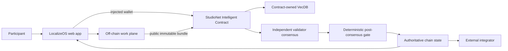

# LocalizeOS — Architecture

## 1. Architectural thesis

LocalizeOS keeps thousands of routine strings off-chain and uses GenLayer only for ambiguous, high-impact or disputed translations. Each accepted difficult translation becomes project-specific semantic memory keyed primarily by the English source string and context. Validators judge fidelity, terminology and tone against a versioned glossary/style guide. A locale release is sealed on-chain only when its escalated cases are resolved.

The architecture preserves one boundary:

> High-volume creation/observation happens off-chain; **a canonical translation for escalated strings plus a locale-release manifest seal** becomes authoritative only after a bounded GenLayer flow.

## 2. System context



Backend/service output is never the authoritative answer.

## 3. Components

### Web application

- domain workflow;
- public browsing;
- injected wallet;
- artifact preparation;
- live contract reads;
- transaction/finality rail;
- semantic-memory display;
- authoritative decision/history pages.

### Off-chain work plane

Cloudflare Worker + D1 + R2. D1 stores strings, routine translation memory, assignments and comments. R2 stores screenshots and locale manifests. Server never signs; release seal is always browser wallet signed.

### Intelligent Contract

Project glossary/style fingerprints; escalated string cases; approved difficult translations; source/context semantic memory; release manifests; contributor decision receipts.

### Contract-owned semantic memory

Embed English source text + UI context + feature/module, not the target translation. Accepted cases are stored per project and locale. A new ambiguous source retrieves same-project examples expressing similar meaning so validators can see how the project historically translated the concept.

## 4. Data ownership

| Data | Source of truth | Mutable | Consensus input |
|---|---|---:|---:|
| Draft/high-volume work | Off-chain service | Yes | No, until frozen |
| Frozen public artifact | Artifact store + chain digest | No | Yes |
| Rules/charter/rubric version | Contract | Versioned | Yes |
| VecDB pointer/vector | Contract | Append by invariant | Yes, bounded retrieval |
| Final status/receipt | Contract | Terminal/versioned | N/A; output |
| UI cache | Browser/service | Yes | Never authoritative |
| Deployment facts | Repository docs + explorer/chain | Append | N/A |

## 5. Domain contract model

- Project { owner, name, source_locale, style_url, style_digest, glossary_url, glossary_digest, policy_version, case_count }
- LocaleCase { project_id, locale, policy_version, string_key, source_text, context_text, candidates_json, artifact_ref, artifact_digest, status, approved_index, memory_ids_json, rationale }
- Release { project_id, locale, policy_version, manifest_url, manifest_digest, required_case_ids_json, sealed_at }
- VectorPointer { case_id, project_id, locale_hash }

## 6. Public contract surface

- create_project(name, source_locale, style_url, style_digest, glossary_url, glossary_digest) -> project_id
- update_language_assets(project_id, style_url, style_digest, glossary_url, glossary_digest) -> policy_version
- open_case(project_id, locale, string_key, source_text, context_text, candidates_json, artifact_ref, artifact_digest) -> case_id
- resolve_case(case_id) -> approved candidate index
- supersede_case(case_id, replacement_case_id)
- seal_release(project_id, locale, manifest_url, manifest_digest, required_case_ids_json) -> release_id
- get_case(case_id)
- get_release(release_id)
- preview_memory(case_id, k)

Third-party consumers must be able to reconstruct the final status from views alone.

## 7. End-to-end sequence

```mermaid
sequenceDiagram
    participant P as Participant
    participant UI as Web
    participant OFF as Off-chain plane
    participant IC as Contract
    participant DB as VecDB
    participant VAL as Validators

    P->>UI: perform normal domain work
    UI->>OFF: save/aggregate/prepare
    OFF-->>UI: immutable public bundle + digest
    P->>UI: approve on-chain escalation
    UI->>IC: injected-wallet submit
    IC->>IC: deterministic preflight/version checks
    IC->>DB: bounded KNN
    DB-->>IC: eligible related memory
    IC->>VAL: rules + evidence + memories
    VAL->>VAL: independent fetch + judgment
    VAL-->>IC: equivalent bounded result
    IC->>IC: validate result + apply deterministic transition
    IC-->>UI: finalized transaction
    UI->>IC: re-read authoritative record
```

## 8. Semantic-memory path

Embedding inputs:

Embed English source text + UI context + feature/module, not the target translation. Accepted cases are stored per project and locale. A new ambiguous source retrieves same-project examples expressing similar meaning so validators can see how the project historically translated the concept.

Decision prompt fields:

- source English text
- UI context/module
- target locale
- candidate translations with stable indices
- style/glossary versioned rules
- placeholder tokens
- retrieved approved source-context memories

The architecture deliberately separates **selection** from **judgment**. A memory hit is never enough to authorize the final transition.

## 9. Off-chain API/service boundary

Expected endpoints/categories:

- `POST /api/v1/import`
- `GET /api/v1/projects/:id/strings`
- `PATCH /api/v1/strings/:key`
- `POST /api/v1/strings/:key/escalation-bundle`
- `POST /api/v1/releases/manifest`
- `GET /api/v1/tm/search`

If this project is frontend-first/no persistent database, those endpoints are limited metadata/cache proxies rather than an authority.

### Artifact freeze flow

```text
draft mutable data
  -> validate/publicity check
  -> canonical serialization
  -> SHA-256 digest
  -> immutable public object/ref
  -> user sees digest + preview
  -> injected-wallet chain submission
```

Once the digest is submitted, editing produces a new object/digest rather than replacing the old evidence.

## 10. Route architecture

| Route | Domain screen | Primary action |
| --- | --- | --- |
| / | Bilingual editor | Translate/select string |
| /queue | String queue | Open string |
| /strings/[key] | Context preview | Save/off-chain approve/escalate |
| /policy | Glossary/style drawer | Publish policy version |
| /cases/[id] | Disagreement desk | Run resolution |
| /releases | Release checklist | Seal release |
| /releases/[id] | Locale release receipt | Copy manifest receipt |

The full layout rules are in `ui/ux.md`.

## 11. State transition principles

Status vocabulary:

```text
ROUTINE_OFFCHAIN, ESCALATED, PENDING, APPROVED, ABSTAINED, SUPERSEDED, RELEASE_SEALED
```

Implement an explicit transition table in code/tests. Do not infer allowed transitions from ordering above.

A final record is immutable. Corrections create an explicit version/supersession/new case.

## 12. Consensus boundary

Decision:

> Given source string, UI context, target locale, versioned glossary/style rules, candidate translations and retrieved approved examples, which submitted candidate (or ABSTAIN) best preserves meaning, terminology, placeholders and tone? Validators choose from bounded candidates; they cannot invent a new production string in MVP.

### Before nondeterminism

- role/identity;
- record exists;
- state allows review;
- base version current;
- sizes/counts bounded;
- immutable evidence refs syntactically valid;
- required enumerations allowed.

### Inside nondeterminism

- independently fetch public evidence where needed;
- interpret semantic evidence;
- compare retrieved memories for applicability;
- return fixed enums/bands/IDs.

### After nondeterminism

- validate all returned IDs/enums;
- re-check base state;
- deterministic arithmetic/state changes;
- memory insertion;
- events/counters.

## 13. Security boundaries

### User/caller

Cannot make user-submitted prose authoritative external evidence by assertion.

### Public evidence

Potential prompt injection. Bound and frame as data. Unavailable evidence fails closed.

### Semantic memory

Public and fallible as precedent/context. Namespace/version filters are deterministic.

### Off-chain service

Can coordinate; cannot sign/finalize chain.

### Wallet

Actual provider account/network immediately before signature is authoritative.

### Runtime

Finalized transaction status alone is not success; GenVM execution must be inspected.

## 14. Failure semantics

| Failure | Result |
|---|---|
| Artifact service unavailable before freeze | no submission |
| Evidence URL unavailable during consensus | explicit insufficient/failure; no positive state |
| No eligible VecDB memories | proceed only if domain rules permit; show “no related memory” |
| Validator disagreement | no unauthorized final state |
| Stale base version | reject before consensus |
| FINALIZED + rollback | show failure, re-read state |
| Malformed live read | unavailable, not empty/default |
| Backend stale cache | chain wins |

## 15. Scaling model

The product scales because the repeated/high-volume work is outside consensus.

- Paginate chain lists.
- Keep stored strings bounded.
- Use small vector pointers.
- Use deterministic domain filters around KNN.
- Keep validator context small.
- Split oversized cases/releases rather than raising every bound.
- Benchmark actual runtime before claiming large VecDB scale.

## 16. Observability

Log without secrets:

- artifact digest;
- record/case IDs;
- tx hashes;
- wallet chain changes;
- finality state;
- GenVM result;
- source fetch failure category;
- selected memory IDs;
- contract status after re-read.

## 17. Project invariants

- Approved translation must equal one submitted bounded candidate.
- Placeholders/ICU tokens must be preserved by deterministic validation before consensus.
- Case is pinned to glossary/style policy version.
- Only APPROVED cases may enter semantic memory.
- Release cannot seal while a required escalated case is unresolved.
- Release manifest digest is immutable.

## 18. Concrete test scenario

String `Delete workspace` in a destructive settings dialog with candidates in French/Spanish; another memory for `Remove project permanently` provides related terminology but must not be treated as identical.

## 19. Reference end-to-end demo

Import 40 strings, mark most as routine, escalate five ambiguous product terms with 2-3 candidates each, resolve them using glossary + semantic memory, then seal a locale release manifest on StudioNet.
